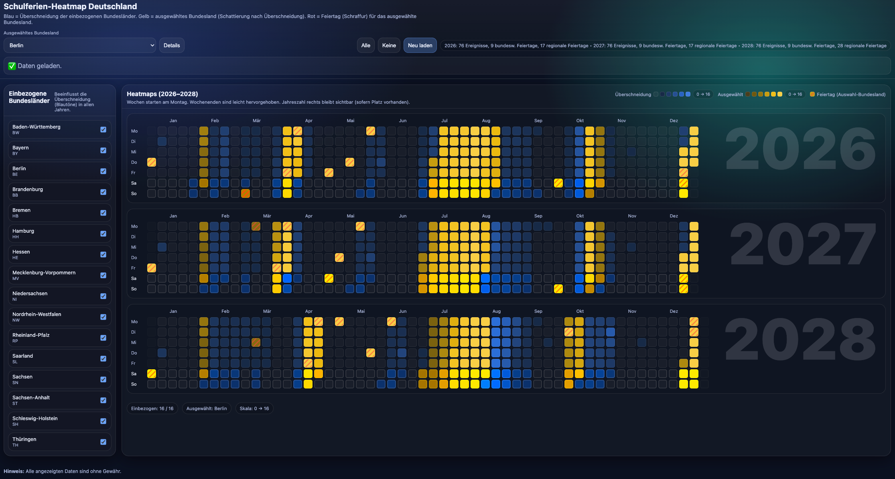

# Holiday Heatmap

A visual heatmap of German school holidays to highlight periods when the highest number of people are likely to be on vacation.

The project overlays school holiday schedules from all 16 German federal states, making it easy to identify peak travel periods and compare holiday overlaps across regions.

## ✨ Purpose

Germany has different school holiday dates depending on the federal state.  
This project helps visualize:

- when holiday periods overlap most strongly
- when travel demand is likely highest
- which weeks are typically less crowded

## 📅 Data

The holiday data and parts of the code were generated with AI assistance.

**Important:**  
The provided dates are based on German school holiday schedules for **2026–2028**, but correctness is **not guaranteed** and should be verified before using the data for planning or official purposes.

## 🌍 Website

Visit the live project here:

https://sebastianneubert.github.io/holiday-map/

## ⚠️ Disclaimer

This project is intended for visualization and exploration only.
It is not an official source for school holiday information.
